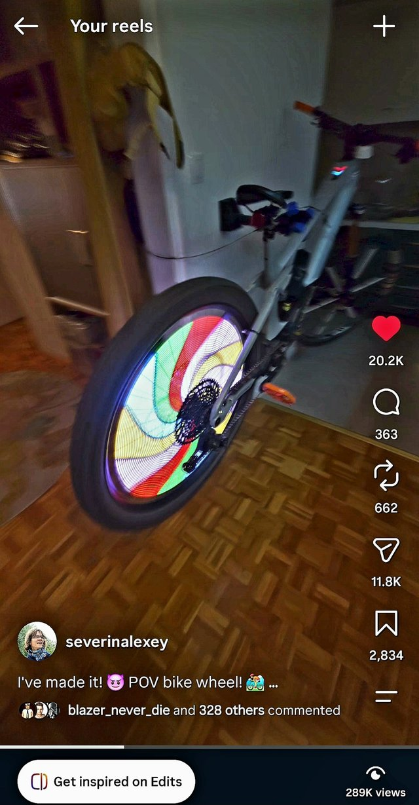
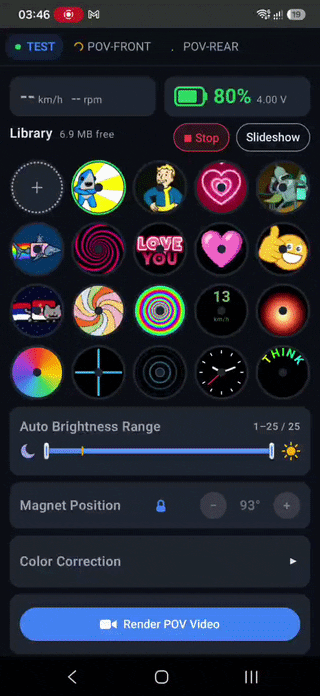

<div align="center">

# 🚲 POV Wheel Display

### Turn your 29" MTB wheel into a full-colour video screen

A double-sided **Persistence-Of-Vision Display** that lives inside a mountain-bike wheel:
528 LEDs on six spinning arms paint photos, animations, video, a live speedometer, a clock and
your own text right onto bike wheel! You control it from an Android app over Bluetooth.


<a href="https://www.instagram.com/reel/DeDYKcECSC1/">
  
</a>

▶️ **[Watch it in action on Instagram](https://www.instagram.com/reel/DeDYKcECSC1/)**

</div>

---

## ✨ Highlights

| | |
|---|---|
| 🚵 **Built for a 29" MTB wheel** | Designed from scratch to fit between the spokes of a 29-inch mountain-bike wheel. Works on the **front and the rear wheel**. The wheel detects which way it spins and keeps the image the right way round on both. |
| 💧 **Water-resistant enclosure** | Sealed housing made for real rides: rain, mud and puddles. |
| 🔋 **Up to 6 hours of animation** | One charge covers a whole evening ride. A smart battery gauge shows the real remaining percentage. |
| 💤 **Up to a year on standby** | It draws about 10 µA asleep and wakes when you **shake the wheel**. Transport mode ignores vibration completely, so it won't wake up in a car or on a bike rack. |
| 📱 **Android app over BLE** | Connect **several displays at once** and run a synced slideshow across them. |
| 🎬 **Render POV video from any camera** | Film your ride with a phone, action cam or drone, and the app turns the clip into a clean, flicker-free POV video. |
| 🖼️ **Photos, GIFs, video, text** | Drop in a picture, GIF, animated WebP or MP4. The phone converts it and shows you a preview of exactly what the wheel will display. |
| 🎯 **Sharp, stable image** | 1° angular resolution, sub-degree interpolation, anti-aliasing and acceleration-aware rotor tracking. The picture stays put while you speed up or brake hard. |

---

## 🚵 Made for a 29" mountain bike

The geometry and every engineering trade-off target one use case: a 29" MTB wheel on real trails.

| | |
|---|---|
| **Display** | 6 arms × 88 LEDs = **528 SK9822-A** (27 kHz PWM, 20 MHz clock), double-sided, 44 LEDs per face |
| **Image size** | **~55 cm disc** (LED radius 49–273 mm), fits inside a 29" rim |
| **Resolution** | 360 × 44 polar pixels per frame, **256 colours per frame** (own palette for every frame) |
| **Refresh** | Six arms draw the full image every **1/6 of a turn**: 20 Hz at ~28 km/h |
| **Turns on** | from **~15 km/h** (110 rpm, adjustable in the app) |
| **Animation length** | up to **~48 s at 10 fps** in RAM, **13 MB** library on flash |
| **Brains** | ESP32-S3, 16 MB flash, 8 MB PSRAM |
| **Sync** | **6 Hall sensors** (one per arm) + one magnet on the fork or frame |
| **Sensors** | Ambient light (auto-brightness), vibration (wake by shake) |
| **Power** | 1S6P Li-Po pack — six 1000 mAh cells in parallel, **6000 mAh** total — with USB charging, **up to 6 h** display time, **up to 1 year** standby |
| **Enclosure** | Water-resistant |

**Both sides are readable.** Text, the clock and the speedometer are mirrored on the far face, so
riders on either side of the bike read them correctly. Logos and pictures can do the same: tick
*Mirror back face* when you upload.

---

## 📱 The app



Everything runs from a handy Android app (Kotlin + Jetpack Compose, Android 8.0+) over Bluetooth LE,
and it can drive several displays at once.

- 📚 **Library.** Your files and effects in one grid, each with an animated round preview that
  matches what the rim shows. Tap to play.
- ➕ **Add anything.** Photos, GIFs, animated WebP and **video** (MP4 / WebM / MOV) with crop or
  fit, fps, start time and length. The phone does the polar transform and the palette
  quantisation. The preview shows the disc exactly as the wheel will, with the hub hole.
- ⚡ **Fast upload.** The phone deflate-compresses the file and the wheel unpacks it with the
  decompressor in its ROM. With LE 2M PHY and a credit window instead of per-packet acks, the
  effective speed is 3–5× the raw ~110 kB/s. A CRC32 check means a damaged file is never kept.
- ✍️ **Text editor.** Type a line and it wraps around the rim live as you type. Any system font,
  Cyrillic, smooth anti-aliasing, solid colour or a flowing rainbow.
- 🔁 **Slideshow.** Pick any mix of files and effects. With **two wheels, the slideshow stays in
  sync** across front and rear, and keeps running after you close the app.
- 🎛️ **Display tuning.** Auto-brightness range, magnet position, gamma, contrast, saturation and
  white balance, all applied live.
- 🔋 **Telemetry.** Battery %, charging state, rpm and speed.
- 🛠️ **Maintenance.** Firmware update over Bluetooth, remote power-off into transport mode,
  reboot, device log.

---

## 🎬 Render POV video from any camera

A spinning POV display looks great in person but flickers and tears on camera. Film your ride with
a phone, an action cam or a drone, and the app turns the clip into a clean, flicker-free POV video
right on the phone. The result keeps the original resolution and sound, and slow-motion clips work
too.

---

## 🎨 Built-in effects

| Effect | What it does |
|---|---|
| 🏎️ **Speed** | Live speedometer in big digits that shift from green to red as you speed up (red point set in the app) |
| 🕐 **Clock** | Time `hh:mm:ss` with blinking colons around the top of the rim, the date `yyyy.mm.dd` around the bottom, solid or rainbow |
| ✍️ **Text** | Your text around the rim, solid or rainbow |
| 🌈 **Rainbow** | A colour spiral flowing across the disc — speed and band sharpness set in the app |

Long-press an effect in the app to set it up; the library thumbnail shows it exactly as the rim
will — the real speed, the current time, the chosen colours.

---

## 🔋 Power that lasts

- **Up to 6 hours of animation** on one charge. The CPU drops to 80 MHz whenever the display is
  off and goes to full speed only while drawing.
- **Up to a year on standby** at about 10 µA in deep sleep. The wheel sleeps on its own after a
  minute of inactivity.
- **👋 Shake to wake.** A deliberate shake wakes it. Single bumps in a bag or on a rack don't.
- **🧳 Transport mode.** Hold the button for 1.5 s, or tap *Power off* in the app. Vibration is
  ignored completely and one click wakes the wheel.
- **Honest battery gauge.** It reconstructs the open-circuit voltage, so the percentage doesn't
  jump when the display turns on or the charger is plugged in.
- **Protects the cell.** Brightness is capped when the battery is low and the display stops before
  the cell is deeply discharged. Charging works even from a nearly flat battery.

---

## 🗂️ Repository

| Path | What's inside |
|---|---|
| [src/](src/) · [include/](include/) | ESP32-S3 firmware: rotor tracking, rendering, power management, BLE, effects, Hall log |
| [android/](android/) | Android app (Kotlin / Compose): library, conversion, upload, effects, POV video renderer. See [android/README.md](android/README.md) |
| [tools/](tools/) | Offline helpers |

## 🛠️ Build & flash

```bash
# Firmware
pio run -e cable --target upload      # firmware over USB (never run uploadfs: it would wipe the library)

# Android app
cd android && ./build.sh assembleRelease
```

After the first USB flash, firmware updates go over Bluetooth from the app
(*Maintenance → Update*).

## 📄 License

**Free for personal, non-commercial use** under the
[PolyForm Noncommercial License 1.0.0](LICENSE.md): build a wheel for your own bike, study the
code, change it and share your changes.

**Commercial use requires a separate license from the author.** That covers, for example, selling
wheels, kits or pre-flashed boards, or using the firmware, the app or any part of them in a
commercial product or service. To discuss terms, write to
[severin.alexey.r@gmail.com](mailto:severin.alexey.r@gmail.com).

Third-party libraries keep their own licenses.

© 2026 Aleksei Severin
