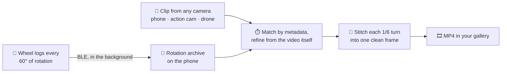

<div align="center">

# 🚲 POV Wheel Display

### Turn your 29" MTB wheel into a full-colour video screen

A double-sided **persistence-of-vision display** that lives inside a mountain-bike wheel:
528 LEDs on six spinning arms paint photos, animations, video, a live speedometer, a clock and
your own text into a 55 cm disc of light. You control it from an Android app over Bluetooth.


https://github.com/user-attachments/assets/de3e84e7-838d-4e36-8ee6-f0384d49a477
&nbsp;&nbsp;


</div>

---

## ✨ Highlights

| | |
|---|---|
| 🚵 **Built for a 29" MTB wheel** | Designed from scratch to fit between the spokes of a 29-inch mountain-bike wheel. Works on the **front and the rear wheel**. The wheel detects which way it spins and keeps the image the right way round on both. |
| 💧 **Water-resistant enclosure** | Sealed housing made for real rides: rain, mud and puddles. |
| 🔋 **Up to 6 hours of animation** | One charge covers a whole evening ride. A smart battery gauge shows the real remaining percentage. |
| 💤 **Up to a year on standby** | It draws about 10 µA asleep and wakes when you **shake the wheel**. Transport mode ignores vibration completely, so it won't wake up in a car or on a bike rack. |
| 📱 **Android app over BLE** | No Wi-Fi hotspot needed, so your mobile data keeps working. Connect **both wheels at once** and run a synced slideshow across them. |
| 🎬 **Render POV video from any camera** | Film your ride with a phone, action cam or drone. The app matches the clip to the wheel's rotation log **by its metadata** and stitches it into a clean, flicker-free POV video. |
| 🖼️ **Photos, GIFs, video, text** | Drop in a picture, GIF, animated WebP or MP4. The phone converts it and shows you a preview of exactly what the wheel will display. |
| 🎯 **Sharp, stable image** | 1° angular resolution, sub-degree interpolation, anti-aliasing and acceleration-aware rotor tracking. The picture stays put while you speed up or brake hard. |

---

## 🚵 Made for a 29" mountain bike

The geometry and every engineering trade-off target one use case: a 29" MTB wheel on real trails.

| | |
|---|---|
| **Display** | 6 arms × 88 LEDs = **528 SK9822** (APA102-class), double-sided, 44 LEDs per face |
| **Image size** | **~55 cm disc** (LED radius 49–273 mm), fits inside a 29" rim |
| **Resolution** | 360 × 44 polar pixels per frame, **256 colours per frame** (own palette for every frame) |
| **Refresh** | Six arms draw the full image every **1/6 of a turn**: 20 Hz at ~28 km/h |
| **Turns on** | from **~17 km/h** (120 rpm, adjustable in the app) |
| **Animation length** | up to **~48 s at 10 fps** in RAM, **13 MB** library on flash |
| **Brains** | ESP32-S3, 16 MB flash, 8 MB PSRAM |
| **Sync** | **6 Hall sensors** (one per arm) + one magnet on the fork or frame |
| **Sensors** | Ambient light (auto-brightness), vibration (wake by shake) |
| **Power** | 1S Li-Po with USB charging, **up to 6 h** display time, **up to 1 year** standby |
| **Enclosure** | Water-resistant |

**Both sides are readable.** Text, the clock and the speedometer are mirrored on the far face, so
riders on either side of the bike read them correctly. Logos and pictures can do the same: tick
*Mirror back face* when you upload.

---

## 📱 The app

The Android app (Kotlin + Jetpack Compose, Android 8.0+) is the main way to use the wheel. A
built-in web UI is still there over opt-in Wi-Fi.

- 📚 **Library.** Your files and effects in one grid, each with an animated round preview that
  matches what the rim shows. Tap to play.
- ➕ **Add anything.** Photos, GIFs, animated WebP and **video** (MP4 / WebM / MOV) with crop or
  fit, fps, start time and length. The phone does the polar transform and the palette
  quantisation. The preview shows the disc exactly as the wheel will, with the hub hole.
- ⚡ **Fast upload.** The phone deflate-compresses the file and the wheel unpacks it with the
  decompressor in its ROM. With LE 2M PHY and a credit window instead of per-packet acks, the
  effective speed is 3–5× the raw ~110 kB/s. A CRC32 check means a damaged file is never kept.
- ✍️ **Text editor.** Type a line and it wraps around the rim live as you type. Any system font,
  Cyrillic, smooth anti-aliasing, solid colour or a flowing rainbow.
- 🔁 **Slideshow.** Pick any mix of files and effects. With **two wheels, the slideshow stays in
  sync** across front and rear, and keeps running after you close the app.
- 🎛️ **Display tuning.** Auto-brightness range, magnet position, gamma, contrast, saturation and
  white balance, all applied live.
- 🔋 **Telemetry.** Battery %, charging state, rpm and speed.
- 🛠️ **Maintenance.** Firmware update over Bluetooth, remote power-off into transport mode,
  reboot, device log.

---

## 🎬 Render POV video from any camera

A spinning POV display looks great in person but terrible on camera. A video frame catches only a
slice of the image, so the result flickers and tears. The app fixes this **after the fact**, from
footage shot on **any camera**:



1. **The wheel keeps a diary.** Every Hall-sensor event is timestamped with microsecond precision.
   The log lives in RAM while you ride and goes to flash before sleep, so a ride without the phone
   isn't lost. The app collects it in the background whenever it's connected.
2. **The clip is found by its metadata.** The app reads the recording time from the container,
   the gallery, the file name or the file date, and tries each as start or end, local time or UTC.
3. **The video itself sets the exact offset.** The disc's brightness pulses in step with the
   rotor. The app picks the offset where those pulses line up with the logged rotation, accurate to
   about ±10 ms.
4. **Each sweep becomes one frame.** Every 1/6 turn is blended into a single clean frame. The
   output keeps the source resolution (2K → 2K, 4K → 4K), real-time speed and the original audio.
   **Slow-motion clips work too.**

All of this runs on the phone's GPU, with no extra hardware and no special camera.

---

## 🎨 Built-in effects

| Effect | What it does |
|---|---|
| 🏎️ **Speed** | Live speedometer in big digits that shift from green to red as you speed up |
| 🕐 **Clock** | Analog clock face with numerals |
| ✍️ **Text** | Your text around the rim, solid or rainbow |
| 🔥 **Fire** | Flames rising from the hub |
| 🌈 **Rainbow** | A colour spiral flowing across the disc |
| 💧 **Ripples** | Concentric waves rolling out from the hub |
| 🎯 **Testing** | Alignment cross with a colour per arm, for calibration |

---

## 🔋 Power that lasts

- **Up to 6 hours of animation** on one charge. The CPU drops to 80 MHz whenever the display is
  off and goes to full speed only while drawing.
- **Up to a year on standby** at about 10 µA in deep sleep. The wheel sleeps on its own after a
  minute of inactivity.
- **👋 Shake to wake.** A deliberate shake wakes it. Single bumps in a bag or on a rack don't.
- **🧳 Transport mode.** Hold the button for 1.5 s, or tap *Power off* in the app. Vibration is
  ignored completely and one click wakes the wheel.
- **Honest battery gauge.** It reconstructs the open-circuit voltage, so the percentage doesn't
  jump when the display turns on or the charger is plugged in.
- **Protects the cell.** Brightness is capped when the battery is low and the display stops before
  the cell is deeply discharged. Charging works even from a nearly flat battery.

---

<details>
<summary><b>🔬 Under the hood: why the image stays sharp</b></summary>

<br/>

- **Acceleration-aware rotor tracking.** Six Hall sensors give six revolution measurements per
  turn. A two-stage PLL with an adaptive angular-acceleration estimate keeps the image fixed while
  you speed up or brake. Without the acceleration term the error would reach tens of degrees under
  hard braking.
- **Per-arm calibration.** Each sensor's mounting offset is measured automatically and applied to
  both timing and rendering, so the six arms line up into one image.
- **Fixed-phase rendering.** Each frame's angle is computed for the moment its LEDs actually light
  up, at a fixed point of the SPI cycle. This removes speed-dependent drift and wobble.
- **Area sampling.** Every LED is averaged over the angle it sweeps while lit. This anti-aliasing
  turns the staircase on straight lines back into smooth edges.
- **Sub-degree interpolation and frame blending.** Edges land between whole degrees, and
  consecutive animation frames are blended so motion doesn't step at the 60° sector borders.
- **256-colour palette per frame.** Median-cut quantisation gives less error than RGB565 at half
  the memory, so twice as many frames fit.
- **Colour pipeline.** Gamma, contrast, saturation, then white balance, then radial brightness
  compensation, so the hub doesn't look brighter than the rim.

More engineering notes are in [CLAUDE.md](CLAUDE.md).

</details>

---

## 🗂️ Repository

| Path | What's inside |
|---|---|
| [src/](src/) · [include/](include/) | ESP32-S3 firmware: rotor tracking, rendering, power management, BLE, effects, Hall log |
| [android/](android/) | Android app (Kotlin / Compose): library, conversion, upload, effects, POV video renderer. See [android/README.md](android/README.md) |
| [data/](data/) | Web UI served from the wheel over opt-in Wi-Fi |
| [tools/](tools/) | Offline helpers |

## 🛠️ Build & flash

```bash
# Firmware
pio run -e cable --target upload      # firmware over USB
pio run -e cable --target uploadfs    # web UI (LittleFS image)

# Android app
cd android && ./build.sh assembleRelease
```

After the first USB flash, firmware updates go over Bluetooth from the app
(*Maintenance → Update*).

## 📄 License

[MIT](LICENSE) © 2026 Aleksei Severin
